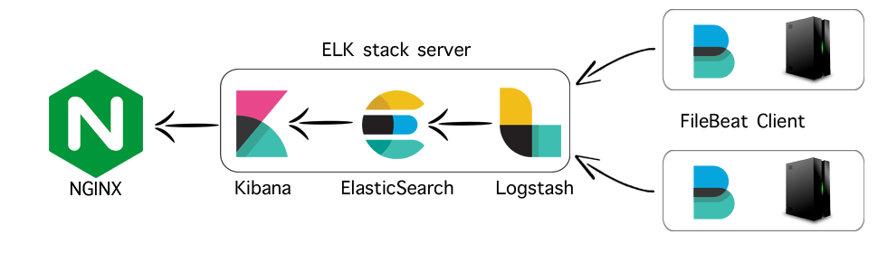

# Projecte Elastic Search, Logstash, Kibana

## Introducció
ELK stack son un conjunt de tecnologies que juntes poden oferir deteccions de incidències en una organització de gran mida.
**Filebeat** s'encarregat d'enviar els registres desde un client, a un fitxer, Elastic Search o Logstash.
**Logstash** es el parsejador de les dades que provenen de diverses fonts i que filtrades podem prescindir d'alguna part del missatge que no es important. 
**Elastic Search** fa el paper de servidor de recerques on s'emmagatzemen les dades ja optimitzades per la indexació. 
**Kibana** serveix per analitzar, crear grafics, i visualitzar en temps real els registres rebuts de les bases de dades de Elastic Search.
Cadascun es pot utilitzar com a eina independent però la unió d'aquests crea una combinació perfecta per a la gestió de registres.

## Index
* [Instal·lació](instalacio)
	* [Com instalar el conjunt ELK](instalacio/README.md)

* [Configuracions](configuracions)
	* [Com configurar Filebeat](configuracions/Filebeat.md#configuració-filebeat-al-client)
	* [Com configurar Logstash](configuracions/Logstash.md#logstash-configuració)
	* [Com configurar Elastic Search](configuracions/ElasticSearch.md#elastic-search-configuració-port-9200)
	* [Com configurar Kibana](configuracions/Kibana.md#kibana-configuració-port-5601)
	* [Com configurar el Certificat](configuracions/Certificats.md#creació-del-certificat-ssl-autosignat)

* [Documentacions](documentacio)
	* [Documentació Filebeat](documentacio/filebeat/Filebeat.md#beats)
	* [Documentació Logstash](documentacio/logstash/Logstash.md#logstash)
	* [Documentació Grok](documentacio/logstash/Grok.md#grok-i-el-seu-filtrat)	
	* [Documentació Elastic Search](documentacio/elasticsearch/ElasticSearch.md#elasticsearch)
	* [Documentació Kibana](documentacio/kibana/Kibana.md#kibana)
	* [Documentació Kibana](documentacio/kibana/kibana/Nginx.md#nginx-configuració)

* [Presentació](presentacio)

Instalació i configuració extreta de diversos tutorials [Digital Ocean Tutorial](https://www.digitalocean.com/community/tutorials/how-to-use-logstash-and-kibana-to-centralize-logs-on-centos-6),
[Logz.io](https://logz.io/learn/complete-guide-elk-stack/)...

Documentació extreta de la [pàgina oficial de ELK](https://www.elastic.co/guide/index.html).
